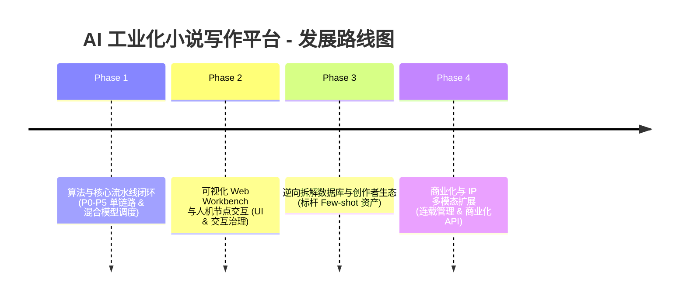

# AI 工业化小说写作平台：产品经理分析与发展路线图

## 1. 产品定位与核心价值主张 (Value Proposition)

### 1.1 产品定位
本项目定位为**工业化、结构化、人机共创的 AI 商业小说创作与 IP 孵化平台**。不同于传统的 "One-prompt" AI 写作或 Simple Chunking / Story-continuation 工具，本平台基于**分层建构模型（小说之树 L0–L4）**与**元认知调度机制（Coordinator + 多 Agent 协作）**，将人类小说创作的复杂认知流程（立意、世界观、人物网、情节弧、场景简报、段落渲染）拆解为高可复刻、高可度量的机器动作。

### 1.2 核心价值主张
1. **解决长文失控与上下文腐烂**：通过外部结构化存储（SQLite/TreeStore/StoryStateStore）+ 动态向量检索（ChromaDB）+ 分层硬约束注入，彻底解耦长篇小说连贯性与 LLM 窗口大小的关系。
2. **拒绝“美颜滤镜”与 AI 腔**：引入园丁 (Gardener) 反共识发散、监工 (Inspector) 零容忍审视、AI-ism 禁用词过滤、基于统计与 Embedding 质心的声音指纹 (Voiceprint) 漂移检测。
3. **闭环人机共创 (Human-in-the-Loop)**：在 5 个关键治理节点设置人类门禁（世界观、人物、大纲、高潮转折、终稿），AI 负责高效发散、收敛与校验，人类把控创意方向与美学锚定。
4. **逆向拆解与数据反哺**：通过拆解师 (Decoder) 对标杆作品（如《三体》《无人生还》）进行骨架、声音、人物、世界规则的四维提取，形成动态 few-shot 资产库，提升商业小说生成质量下限。

---

## 2. 目标用户画像与应用场景 (Target Personas & Use Cases)

| 用户群体 | 核心痛点 | 平台解决方案 | 预期商业价值 |
| :--- | :--- | :--- | :--- |
| **网文/商业小说签约作者** | 连载更新压力大、卡文、长篇伏笔易遗忘/失控 | 自动化场景分解与四层生成，故事世界状态追踪与滚动复盘，伏笔埋设与回收自动提醒 | 生产效率提升 3–5 倍，断更率降低 80% |
| **影视/动漫/游戏 IP 工作室** | 世界观与大纲搭建周期长，团队多编剧协作容易设定冲突 | L0–L2 结构化大纲生成，分层硬约束共享，一致性门禁检测 | IP 世界观与故事大纲孵化周期从数月缩短至数周 |
| **个人独立创作者 / 跨界 AI 玩家** | 缺乏长篇故事结构化编剧能力，写作“业余天花板”明显 | 标杆作品逆向拆解库 + Few-shot 动态注入，元认知 Coordinator 引导推进 | 低门槛创作 8–15 万字结构完整的高质量中长篇小说 |

---

## 3. Codebase 现状评估与 Gap 分析

### 3.1 已实现能力 (As-Is)
- **底层架构**：完成了 `Orchestrator` 元认知调度器，实现了状态机驱动与断点续写机制。
- **Agent 角色划分**：基本实现了 `Gardener`（发散）、`Pruner`（收敛）、`Curator`（固化）、`Inspector`（审视）、`Distiller`（蒸馏）、`Decoder`（拆解）、`ParagraphGenerator`（四层段落生成）、`SceneDecomposer`（场景分解）、`RollingReviewer`（滚动复盘）、`StateWriter`（状态回写）等 Agent。
- **分层存储机制**：结合 SQLite（`novel_state.db`）、TreeStore、StoryStateStore 及本地 ChromaDB 向量库，实现了状态持久化。
- **质量与冷读度量**：集成了客观检测（4-gram 重复率、AI 腔计数）与场景冷读评估（读者理解度、驱动力、信息缺口）。

### 3.2 关键 Gap & 待迭代缺陷
1. **模型混合分层调度尚未彻底落地**：
   - 目前 `config.yaml` 中多使用统一配置，尚未完全实现 $8–10 / 10万字的成本优化架构（Sonnet 4.6 调度 + DeepSeek V4 Flash 执行 + DeepSeek V4 Pro 推理）。
2. **缺少可视化人机交互界面 (Human-in-the-Loop Interactive UI)**：
   - 目前人机门禁依赖 CLI/代码内阻断，缺少 Web 端可视化的“小说之树”管理面板、门禁审批流与人机共创编辑器。
3. **标杆逆向拆解与 Few-shot 库尚待丰富**：
   - 现有的 `Decoder` 具备基础接口，但标杆作品（《三体》《无人生还》《嫌疑人X的献身》《你一生的故事》）的自动化拆解与动态 Few-shot RAG 检索链路仍需深化落地。
4. **连载与长篇超大规模扩展能力预留**：
   - 当前主要针对单本 8–15 万字（第一幕测试验证），对于百万字长篇连载的卷级结构抽象与跨卷一致性检测仍需扩展。

---

## 4. 产品四阶段发展路线图 (Product Development Roadmap)

### Phase 1: 核心引擎强化与混合模型调度优化 (0 – 2 个月)
- **目标**：全面完善后端 Python 多 Agent 体系，打通混合分层模型调度与成本优化。
- **关键交付物**：
  1. **混合模型路由 (Hybrid Model Router)**：配置 Claude Sonnet 4.6 (Coordinator/Distiller)、DeepSeek V4 Flash (Gardener/Pruner/Curator) 与 DeepSeek V4 Pro (Inspector/Decoder) 的精细化分层调用与 Prompt Cache。
  2. **端到端 10 万字生成稳定性**：完善从 L0 世界观到 L4 段落渲染的全流程自动化测试，强化滚动复盘与状态回写逻辑。
  3. **单元测试与 CI/CD 覆盖**：建构完善的 pytest/unittest 自动化测试套件。

### Phase 2: 创作者 Workbench (Web 界面与人机共创) (2 – 4 个月)
- **目标**：打造面向作者与编剧的交互式 Web 创作工作台，降门槛并提升人机协作效率。
- **关键交付物**：
  1. **“小说之树”树状导航与状态图**：直观展示 L0 世界观、L1 人物网、L2 情节弧、L3 场景简报与 L4 段落。
  2. **5 大人机门禁审批流 (Human Gate Panel)**：在卡牌选择、候选打分、大纲调整节点提供一键选择、修改、人工覆写功能。
  3. **富文本人机协协同编辑器**：支持 AI 腔高亮、声音漂移告警提示、一键触发“园丁发散”与“监工审查”。

### Phase 3: 标杆拆解资产库与高级 RAG (4 – 6 个月)
- **目标**：深化逆向拆解流水线，积累优质体裁资产，提升商业小说生成天花板。
- **关键交付物**：
  1. **标杆作品四维数据库**：涵盖科幻、悬疑、都市、奇幻等主流体裁的 50+ 经典作品拆解档案。
  2. **动态 Few-shot 检索增强**：根据场景类型（如“对峙”、“发现线索”、“情感高潮”）智能检索 Top-k 标杆段落风格与骨架注入 Prompt。
  3. **创作者自定义拆解工具**：允许作者上传自己的往期作品或参考小说，一键生成个人/特定作品的声音指纹与人物圣经。

### Phase 4: 连载引擎、商业化 API 与 IP 拓展 (6 – 12 个月)
- **目标**：扩展支持百万字长篇连载，对接网文平台与影视 IP 孵化生态。
- **关键交付物**：
  1. **卷级 (Volume-level) 卷结构与跨卷一致性机制**：支持多卷长篇连载中的状态遗忘控制与角色弧光长期演进。
  2. **商业化 SaaS 与 Open API**：提供团队协同、权限管理、 token 计费以及第三方编剧软件插件接口。
  3. **IP 大纲与分镜导出**：一键将小说场景转化为影视剧本格式或漫改分镜简报 (Comic Storyboard Brief)。

---

## 5. 商业化模式与 OKR

### 5.1 商业化模式 (Monetization Models)
1. **SaaS 订阅制**：针对个人创作者提供按月/按年订阅（包含每月 AI Token 额度、小说之树云端存储、标杆拆解库使用权）。
2. **按作品点数付费 (Pay-per-Novel)**：针对单本 10 万–30 万字作品生成打包计费（如每生成/创作一本小说收取固定点数）。
3. **B 端 Enterprise / Studio 方案**：面向影视工作室、网文 MCN 机构提供私有化部署、自定义声音指纹训练与团队多角色协作套件。

### 5.2 核心 OKR 指标
- **O1: 提升内容生成连贯性与商业可用度**
  - KR1: 10 万字小说生成全流程中，层间冲突率与伏笔遗忘率降低至 < 5%。
  - KR2: 人类编辑在 P5 段落生成阶段的平均修改率低于 15%。
- **O2: 降低生产成本与提升创作效率**
  - KR1: 10 万字单本生成 API Token 成本控制在 $10 以内（基于缓存优化）。
  - KR2: 创作者从零到完成 10 万字自洽大纲与第一幕正文的时间缩短 70%。
