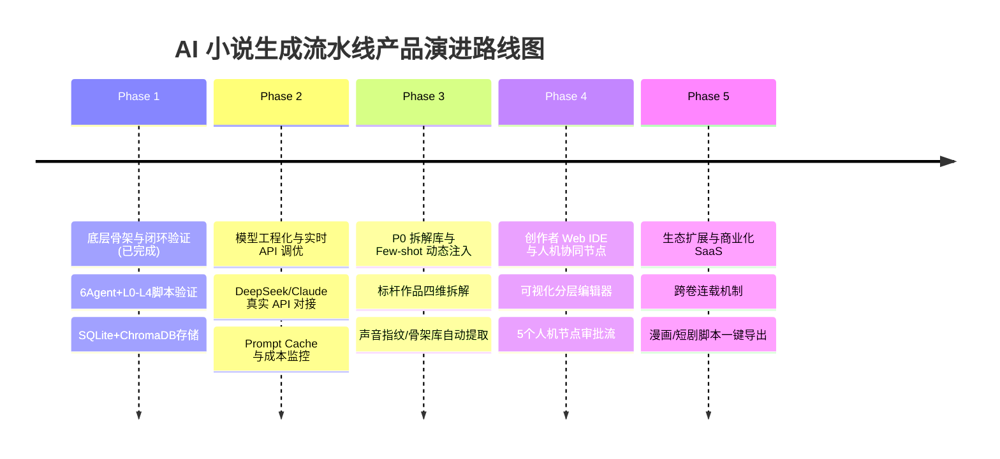

# AI 工业化小说生成流水线：产品发展策略与路线图 (PRODUCT_STRATEGY.md)

> **定位**：基于“小说之树”分层拆解与多 Agent 人机协同的长篇商业小说工业化生产系统。

---

## 一、 产品愿景与核心定位

### 1.1 核心痛点 (Problem Statement)
传统 AI 写作工具（如简单的 Prompt 拼接或通用对话界面）在长篇创作（8万-15万字以上）中普遍存在以下**四大灾难性缺陷**：
1. **上下文失忆与指令衰减**：长文本拼接导致模型忘记前文逻辑与细节设定。
2. **熵塌缩与高频语言回声**：持续生成导致表达模式单一、严重依赖套路词汇（AI 腔）。
3. **叙事认知漂移**：人物性格、语气、动机在章节间发生不可逆漂移，伏笔有埋无收。
4. **业余天花板**：依赖单一动作生成全文，缺乏人类作家“发散-收敛-固化-审视-回溯”的认知分层与自我修正。

### 1.2 核心价值主张 (Value Proposition)
本项目通过 **两次拆解（纵向5层分层 + 横向6种通用动作）**，将长篇小说写作转化为机器可量化、可调度、可审视的工业流水线：
- **可控制的叙事质量**：通过“章节合同”与多维质量门禁（AI腔密度、重复率、声音指纹偏离度），保障文本可读性与商业完本率。
- **高性价比算力调度**：采用“Sonnet 4.6 协调调度 + DeepSeek V4 批量发散/推理”的混合模型架构，将单本 10 万字生成成本控制在 **$8–$10 USD**。
- **人机协同共创 (Human-in-the-Loop)**：在关键决策点（世界观确定、大纲收敛、场景分层审查）保留人类“美学锚定”介入，消除 AI 假高潮与套路化问题。

---

## 二、 现状评估与 Gap 分析 (As-Is vs. To-Be)

目前代码库已具备极佳的**底层引擎与多 Agent 架构雏形**，但在向**商业级 SaaS / 工业化 IP 工具**演进过程中，仍需填补以下差距：

| 维度 | 当前实现状态 (As-Is) | SOP 规范目标 (To-Be) | 演进 Gap & 优化方向 |
| :--- | :--- | :--- | :--- |
| **流水线覆盖** | 已完成 Phase 1 (L0-L2 大纲) & Phase 2 (L3-L4 场景分解/段落生成) 验证脚本 | 全流程 P0-P6 自动/半自动闭环调度 | 需打通 P0 标杆拆解反哺与 P6 卷末/全书统一审视 |
| **Agent 协作** | 拥有 Gardener, Pruner, Curator, Inspector, StateWriter, RollingReviewer | 7大 Agent 完整协同与元认知调度 | 完善 Coordinator（协调者）的回溯决策树与跨层状态纠偏能力 |
| **记忆与存储** | 支持 SQLite 状态存取、JSON 快照与 ChromaDB 向量检索 | 完备的动态压缩 + 分层硬约束注入 | 增加远章摘要动态压缩逻辑与前文片段的精确 Embedding 关联 |
| **模型接入** | 实现了 MockLLMClient 与 StandardLLMClient 基础封装 | 混合三层调度 (Sonnet 4.6 + DeepSeek V4) | 引入多厂商 API 路由管理、Token 消耗统计与 Cache 命中优化 |
| **人机交互** | 命令行脚本 (`run_l0_l2.py`, `run_l3_l4.py`) 驱动 | 5 大人机节点 Web 可视化审批/协同界面 | 从 CLI 转向 Web 前后端分离的辅助创作平台 (Human-in-the-Loop IDE) |

---

## 三、 产品演进 Roadmap（五期规划）

### Phase 1: 核心引擎与闭环验证 (Current Stage - 100% Milestone Achieved)
- [x] **架构搭建**：建立 L0-L4 分层模型（世界观 → 人物网 → 情节弧 → 场景简报 → 4层段落）。
- [x] **Agent 实现**：实现发散 (Gardener)、收敛 (Pruner)、固化 (Curator)、审视 (Inspector)、状态回写 (StateWriter)、滚动复盘 (RollingReviewer)。
- [x] **指标门禁**：内置 n-gram 重复率检测、AI 腔禁用词过滤、冷读评估与伏笔遗忘追踪。

### Phase 2: 模型工程化与真实 API 生产化 (1-2 个月)
- **多模型混合路由**：配置云端 LLM 路由器，对 Gardener/Pruner 调度 DeepSeek V4 Flash，对 Orchestrator/Distiller 调度 Sonnet 4.6。
- **Token Cache 优化**：针对 System Prompt 和历史 Context 启用 DeepSeek / Anthropic 前缀缓存，降低 60%-80% 算力开销。
- **异常恢复与断点续写**：强化 `novel_state.db` 状态机，保证 API 调用超时或中断后，支持单个场景级别的精准 Resume。

### Phase 3: P0 反向拆解库与 Few-Shot 动态注入 (2-3 个月)
- **标杆拆解流水线 (Decoder Agent)**：对悬疑/科幻标杆文本进行“世界观、人物弧、三幕结构、声音特征”四维自动化提取。
- **Few-Shot 动态检索**：建立基于 ChromaDB 的创作素材库，根据当前场景类型（如“对决/解密/情绪爆发”）自动检索标杆结构片段并注入 Prompt。
- **版权防范机制**：确保存储与注入的均为结构化骨架与特征向量，禁止直接拼接标杆原文，4-gram Jaccard 重复度高于 15% 自动拦截。

### Phase 4: 创作者 Web IDE 与人机协同平台 (3-4 个月)
- **可视化“小说之树”编辑器**：提供树状大纲、人物关系图谱、伏笔登记表的可视化看板。
- **5 大人机介入节点**：
  1. *Node 1*：核心设定与立意筛选 (L0)
  2. *Node 2*：人物弧光与冲突关系定稿 (L1)
  3. *Node 3*：章节大纲与伏笔埋设审批 (L2)
  4. *Node 4*：高潮场景生成前批注与指导 (L3-L4)
  5. *Node 5*：整卷冷读与美学锚定校准 (P6)
- **实时质量告警**：在 Web 界面实时展示 AI-ism 密度、声音漂移预警与连续性冲突提示。

### Phase 5: 商业化 SaaS 与 IP 衍生生态 (5+ 个月)
- **连载与长篇扩容机制**：引入跨卷动态记忆压缩，支持 50-100 万字长篇网文连载。
- **IP 衍生一键转换**：基于结构化的 L3/L4 场景简报，一键生成漫改脚本、短剧分镜脚本（Storyboard Prompt）。
- **多租户 SaaS 部署**：面向网文工作室、网文平台与独立作家提供按字数/算力计费的 API & SaaS 订阅服务。

---

## 四、 质量度量与 KPI 矩阵

系统通过**量化指标**保障小说工业化产出的商业下限与艺术上限：

| 评估维度 | 指标名称 | 商业/质量目标 | 测量方式 | 超标触发动作 |
| :--- | :--- | :--- | :--- | :--- |
| **文本流畅度** | 4-gram 重复率 | `< 8%` | n-gram 词频重叠度计算 | 园丁重发散或强制重写 |
| **反 AI 腔** | AI-ism 敏感词密度 | `0 处` | 禁用词表 + 模式匹配 | 句子级重写 |
| **人物塑造** | 声音偏离度 | `< 0.3` | 角色语言指纹余弦距离 | 对话层重写 |
| **情节连贯性** | 伏笔回收率 | `≥ 90%` | StoryStateStore 伏笔登记簿核查 | 滚动复盘触发 P6 补收 |
| **生成成本** | 单本算力开销 | `$8 - $10 / 10万字` | LLM Token 计费与 Cache 统计 | 动态降级至 Flash 模型 |
| **生产效率** | 单本生成耗时 | `< 2 小时` (全自动模式) | 流水线执行时间统计 | 并行化场景生成 |

---

## 五、 商业化策略与目标用户

### 5.1 目标用户画像
1. **网文工作室/签约作者**：需要快速爆款试错、稳定日更 6000-10000 字的量产需求。
2. **短剧/微短剧编剧团队**：依赖强结构、高冲突、快节奏的场景设计，需一键产出带视觉感官与对话的剧本大纲。
3. **IP 运营机构**：需要将现有短篇点子扩展为长篇小说，或进行跨体裁改编。

### 5.2 商业模式 (Business Models)
- **SaaS 阶梯订阅 (B2C)**：提供免费额度 + 月费订阅，按月提供点数（用于生成章节/大纲）。
- **企业级 API/私有化部署 (B2B)**：为头部网文平台提供定制化 Agent 系统与私有模型微调服务。
- **IP 分成模式**：与优质创作者合作，流水线辅助创作爆款 IP，享有后续影视/动漫改编权益分成。

---

## 六、 总结

本产品方案不追逐“纯 AI 一键生成”的噱头，而是坚定走**“认知拆解 + 工业流水线 + 人机协同”**的工程化路线。通过严格的分层约束、外部存储与质量闭环，彻底解决长篇 AI 写作失控的问题，打造长篇文本生成领域的工业级标杆。
